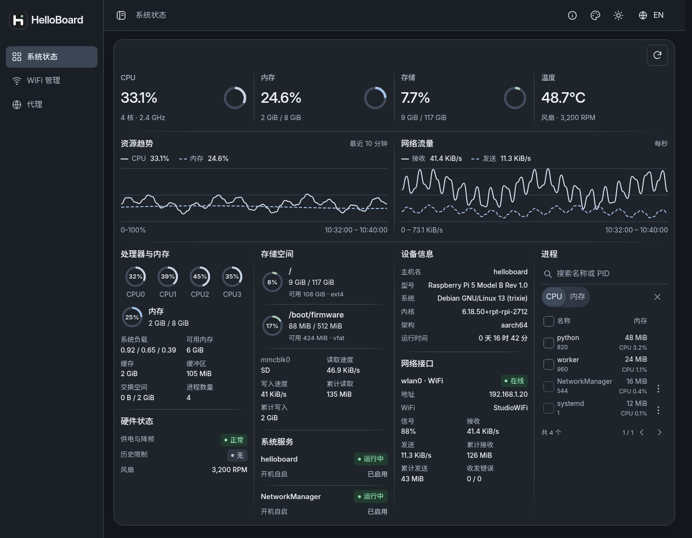
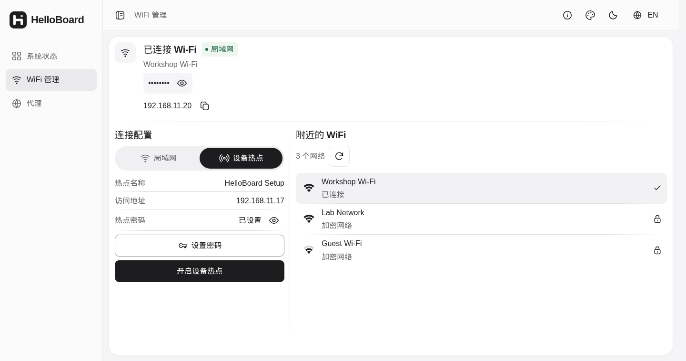

<h1 align="center">HelloBoard</h1>

<p align="center">A browser dashboard for monitoring Linux devices and managing their Wi-Fi.</p>

<p align="center">
  <a href="#features">Features</a> ·
  <a href="#screenshots">Screenshots</a> ·
  <a href="#quick-start">Quick start</a> ·
  <a href="#docker">Docker</a> ·
  <a href="docs/project-guide.md">中文指南</a>
</p>


## Features

| Feature | What you can do |
| --- | --- |
| System monitoring | Track CPU, memory, disk, network traffic, uptime, and hardware metrics where available. Live charts share in-memory history across browsers. |
| Process management | Search and sort processes by CPU or memory. On supported Linux deployments, verify your system account to terminate selected processes. |
| Wi-Fi and device hotspot | Scan for networks, reconnect to saved networks, and switch between Wi-Fi and hotspot mode on compatible NetworkManager devices. |
| Setup hotspot | On first startup with host Wi-Fi control, give NetworkManager 60 seconds by default to join a network. If it cannot connect in time, open the setup hotspot and retain the saved configuration. |
| Bash proxy | Test an HTTP proxy before saving it to the host user's Bash configuration, and turn it off from the same page. Requires the host proxy service. |
| Responsive interface | Use the dashboard on desktop or mobile in English or Chinese, with light and dark themes and compact or spacious layouts. |

HelloBoard uses Flask, Waitress, and browser-native HTML, CSS, and JavaScript. It serves its fonts and icons locally. See the benchmark summary for the sampling design and historical memory and transfer measurements. [Benchmark summary](docs/benchmarks.md)

## Screenshots

### System dashboard · dark theme



### Wi-Fi management


### Device hotspot



### Bash proxy


### Mobile layout


The screenshots use example device, network, and proxy settings.

## Quick start

Use Python 3.10 or later. On Debian, Ubuntu, and Raspberry Pi OS, install the prerequisites and run:

```bash
sudo apt install git python3 python3-venv
git clone https://github.com/GCUSMS-AI-ProJect/helloboard.git
cd helloboard
python3 -m venv .venv
.venv/bin/python -m pip install -r requirements.txt
.venv/bin/python wifi.py --dashboard-only
```

Open [HelloBoard on port 8090](http://localhost:8090) on the device, or use the device's private IP from the same network. Dashboard-only mode leaves the network configuration to the host.

### Linux service and Wi-Fi management

Stop the foreground dashboard, then install the systemd service to use port 80.

```bash
sudo bash install.sh
sudo systemctl enable --now helloboard
```

To enable Wi-Fi management on a new installation, run `sudo bash install.sh --with-wifi` in place of the default install command. It requires NetworkManager and a managed adapter. Hotspot mode also requires AP support. The service applies your saved network mode when it starts. [Installation and updates](docs/getting-started.md)

For local discovery on Debian or Ubuntu, install `avahi-daemon` and run `sudo python3 tools/enable_local_name.py`. Open [helloboard.local](http://helloboard.local) on the same network from an mDNS-capable client. [Local discovery guide](docs/operations.md)

## Docker

Build and start a system dashboard on the Docker host:

```bash
docker build -t helloboard .
docker run --rm -p 127.0.0.1:8090:8090 helloboard
```

For read-only host Wi-Fi status, run the snapshot exporter on the host every 15 seconds:

```bash
python3 tools/export_wifi_snapshot.py ./wifi-cache --interface wlan0
```

Mount the snapshot directory when starting the container:

```bash
docker run --rm -p 127.0.0.1:8090:8090 \
  -v "$PWD/wifi-cache:/run/helloboard-wifi:ro" \
  helloboard --wifi-snapshot /run/helloboard-wifi/latest.json --interface wlan0
```

Replace `wlan0` with the host adapter in both commands. Snapshots expire after 90 seconds. For optional snapshot-mode panel login, mount a private Werkzeug password hash at `/home/helloboard/.helloboard-password-hash` and grant the container user read access.

For a Raspberry Pi container with host Wi-Fi management and the Bash proxy panel, use the deployment repository. It provisions the host services that the container calls. [Raspberry Pi Docker deployment](https://github.com/GCUSMS-AI-ProJect/hello_docker_pi)

## Platform support

Linux is the primary platform. Available metrics and controls depend on system permissions and hardware. The Windows scripts enable monitoring, with physical Windows-host verification still pending. Use HelloBoard on a trusted local network and keep device credentials in the local configuration. [Supported platforms and permissions](docs/getting-started.md)

## Documentation

- [Installation, updates, and troubleshooting](docs/getting-started.md)
- [Benchmark summary](docs/benchmarks.md)
- [UI design prompt (Chinese)](PROMPT.md)
- [Project guide and installation (Chinese)](docs/project-guide.md)
- [Deployment and local discovery (Chinese)](docs/operations.md)
- [Performance measurements (Chinese)](docs/performance.md)
- [Offline Ubuntu amd64 package (Chinese)](docs/deb.md)
- [Font sources and licenses](static/fonts/SOURCES.md)

## Feedback

Include your OS, architecture, Python version, commit, and reproduction steps when reporting an issue. Remove private information from logs and screenshots. [GitHub Issues](https://github.com/GCUSMS-AI-ProJect/helloboard/issues)

## License

HelloBoard's own code currently has no project-level license. Third-party assets and runtimes retain their respective licenses. [Fonts](static/fonts/SOURCES.md) · [Lucide icons](static/lucide-LICENSE.txt) · [Bundled runtime notices](packaging/deb/runtime-licenses)
